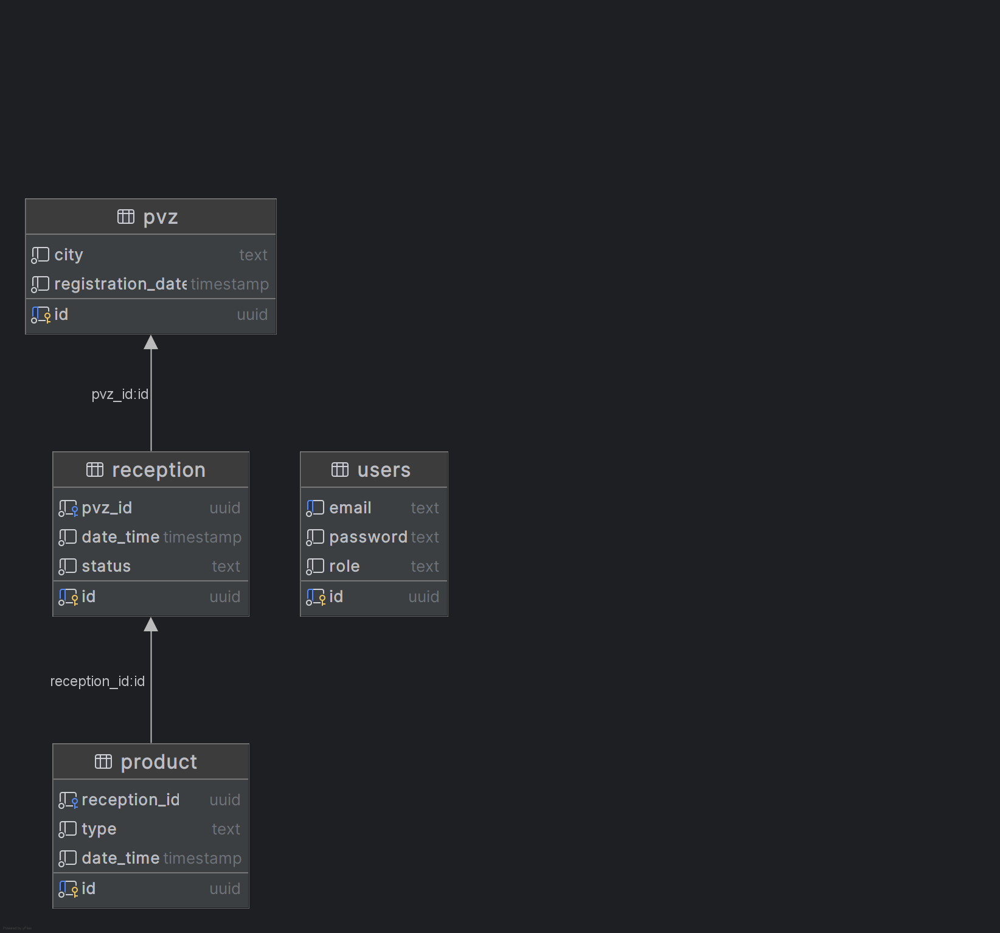

# PVZ Management Backend

Сервис для управления пунктами выдачи заказов (ПВЗ), приёмкой товаров и учётом продукции.

---

## 📦 Основной функционал

- Регистрация и логин пользователей (JWT)
- Создание и фильтрация ПВЗ
- Приёмка товаров: создание, закрытие, добавление/удаление товаров
- gRPC метод получения всех ПВЗ без авторизации
- Метрики Prometheus на порту `9000`
- OpenAPI спецификация REST API
- CI/CD pipeline (GitHub Actions)

---

## 🧠 Условие задачи

Файл [`Backend-trainee-assignment-spring-2025.md`](./docs/Backend-trainee-assignment-spring-2025.md)

---

## 📁 Структура проекта

```
.
├── api/                         # OpenAPI и gRPC спецификации
│   ├── swagger.yaml             # OpenAPI 3.0
│   ├── oapi-codegen.yaml        # Конфиг генератора oapi-codegen
│   └── pvz.proto                # gRPC описание
├── build/                       # Docker-файлы
│   ├── Dockerfile
│   └── docker-compose.yml
├── cmd/
│   └── pvzapp/                  # Точка входа приложения
├── docs/                        # Документация
│   ├── Backend-trainee-assignment-spring-2025.md
│   └── product.png              # Схема БД
├── init/
│   ├── generate/                # Генерация моков
│   └── migrations/             # SQL миграции
├── internal/
│   ├── adapters/
│   │   ├── api/                 # Контроллеры REST и gRPC
│   │   │   ├── grpc/
│   │   │   └── rest/
│   │   └── db/
│   │       ├── mocks/          # Моки для тестов
│   │       └── postgreSQL/     # Реализация репозиториев
│   ├── app/                     # Настройка роутера и приложения
│   ├── config/                  # Загрузка конфигураций
│   ├── domain/
│   │   ├── models/              # Общие структуры данных
│   │   ├── models_gen/          # DTO, сгенерированные из swagger.yaml
│   │   └── usecases/            # Интерфейсы бизнес-логики
│   └── usecases_impl/           # Реализации usecase'ов
├── tests/
│   ├── integration/             # Интеграционные тесты
│   └── unit/                    # Юнит-тесты
├── go.mod
└── README.md
```

---

## ⚙️ Переменные окружения по умолчанию

| Переменная      | Назначение             | Значение по умолчанию |
|-----------------|------------------------|------------------------|
| `DB_HOST`       | Хост PostgreSQL        | `localhost`            |
| `DB_PORT`       | Порт PostgreSQL        | `5432`                 |
| `DB_USER`       | Пользователь БД        | `postgres`             |
| `DB_PASSWORD`   | Пароль БД              | `password`             |
| `DB_NAME`       | Название БД            | `pvz`                  |
| `APP_PORT`      | REST API порт          | `8080`                 |
| `APP_GRPC_PORT` | gRPC API порт          | `3000`                 |
| `JWT_SECRET`    | Секрет для JWT         | `jwt-secret`           |
| `METRICS_PORT`  | Порт для метрик        | `9000`                 |

---

## 🧪 Тестирование

### Юнит-тесты

```bash
go test ./tests/unit/... -v
```

### Интеграционные тесты

```bash
go test ./tests/integration/... -v -count=1
```

> Убедись, что PostgreSQL доступен на `localhost:5432`.

---

## ✨ Генерация

### Моки

```bash
go generate ./init/generate/...
```

### DTO по Swagger

```bash
oapi-codegen -config api/oapi-codegen.yaml api/swagger.yaml
```

---

## 🛰️ gRPC

- Интерфейс описан в `api/pvz.proto`
- Сервер доступен на порту `:3000`
- Не требует авторизации

---

## 📈 Метрики

- Доступны в Prometheus-совместимом формате
- Экспонируются по адресу `:9000/metrics`

---

## 🐳 Docker

```bash
docker-compose -f build/docker-compose.yml up --build
```

Пример `.env` файла:

```env
DB_HOST=localhost
DB_PORT=5432
DB_USER=postgres
DB_PASSWORD=password
DB_NAME=pvz
APP_PORT=8080
APP_GRPC_PORT=3000
JWT_SECRET=jwt-secret
METRICS_PORT=9000
```

---

## 📋 CI/CD

- Конфигурация в `.github/workflows/ci.yml`
- Включает: генерацию DTO, запуск юнит и интеграционных тестов, сборку Docker-образа

---

## 🗃️ Схема базы данных

Файл: [`docs/product.png`](./docs/product.png)



---
